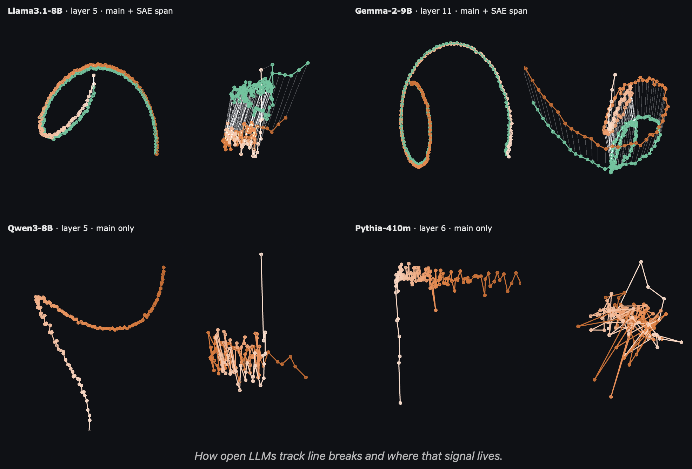

<h1 align="center">Chasing the Counting Manifold in Open LLMs</h1>

[](LICENSE)
[](https://huggingface.co/spaces/t-tech/manifolds)



We reproduced some of the experiments from Anthropic’s ["When Models Manipulate Manifolds: The Geometry of a Counting Task"](https://transformer-circuits.pub/2025/linebreaks/index.html). The code is in this repository, and the interactive reproduction is available [here](https://huggingface.co/spaces/t-tech/manifolds) — go check it out.

# Cite Us

```
@misc{sinii2026_chasing_the_counting_manifold_in_open_llms,
  title={Chasing the Counting Manifold in Open LLMs},
  author={Viacheslav Sinii and Nikita Balagansky},
  year={2026}, 
  url={https://huggingface.co/spaces/t-tech/manifolds},
}
```